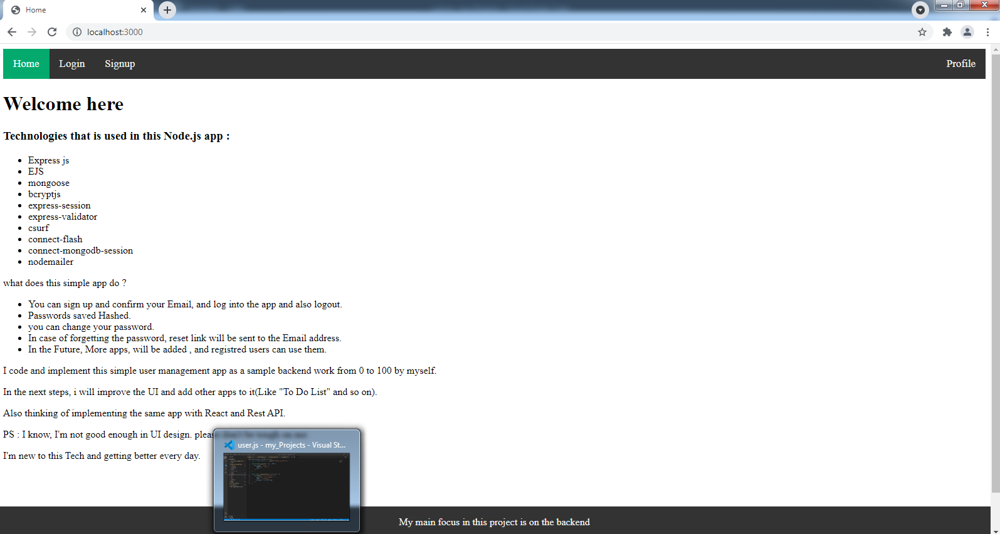
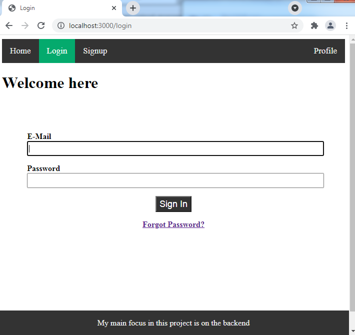
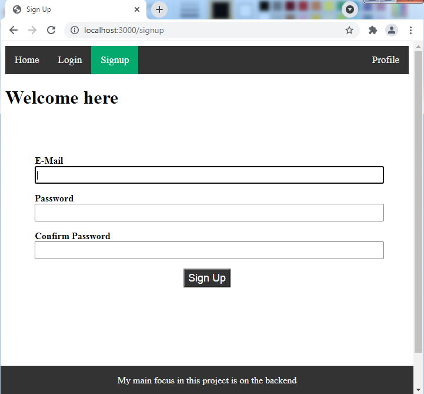

# Simple account manager
This is a simple account manager , for signup , login, and resetting passwords.

### In the future :
I will implement this project temporary in a host and put the link here later.
In the Future, More apps, will be added , and registered users can use them.

### Introduction :
You can signup, and verify your Email, and login and change password, and logout and in the case of forgetting the password, ask for reset link to your Email.

Passwords will save in the mongoDB hashed.

MVC architecture and routing is used.

Main focus in this project is on the beckend.

### Technologies :
* Node.js
* MongoDB
* Express js
* EJS
* express-session
* express-validator
* mongoose
* nodemailer
* csurf
* bcryptjs
* crypto

### Requirements :
To run the project you need to have installed NodeJs, MongoDB.

### Screenshots :

Home Page :

Login Page :

Signup Page :

Profile Page :

### Run the app
after establishing MongoDB database

You need to set your Mailing service Data in the ./utils/mail-options.js , or for get the confirmation link or reset link, just log the link in the ./controllers/auth.js

Open terminal in the project folder

// to install packages :

$npm install

// to run the app :

$npm start

// open the browser on port 3000

http://localhost:3000/

// To stop the server :
just press Ctrl+C in Terminal

### More about working on this project
I code and implement this simple user management app as a sample backend work from 0 to 100 by myself.

In the next steps, i will improve the UI and add other apps to it(Like "To Do List" and so on).

Also thinking of implementing the same app with React and Rest API.

PS : I know, I'm not good enough in UI design. please don't be tough on me.

I'm new to this Tech and getting better every day.
